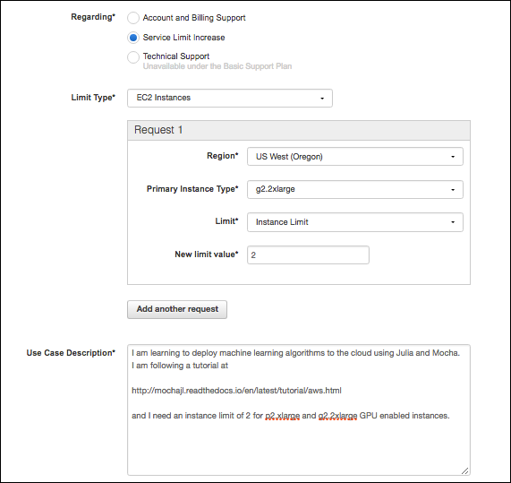
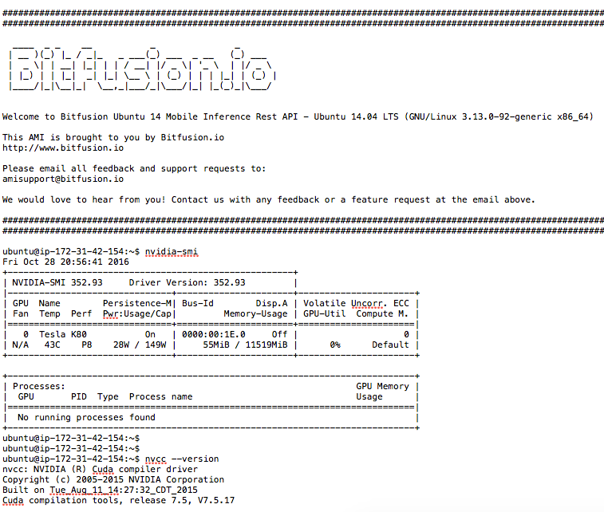
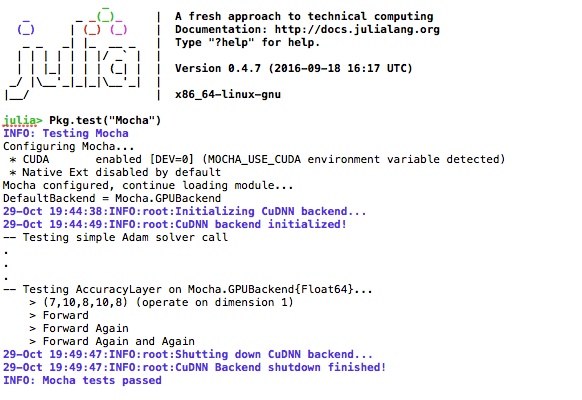
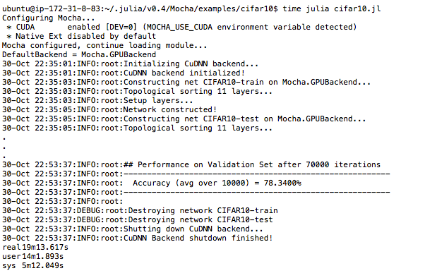

Mocha in the Cloud
==================================

The real power of developing deep learning networks is only realized
when you can test your ideas and run your models on powerful compute
platforms that complete training in a fraction of the time it took only
a few years ago. Today, state-of-the-art machine learning algorithms
routinely run on cloud based compute that offers access to cutting edge
GPU technology for a tiny cost compared to buying the GPU hardware and
running it in your personal or company servers.

Amazon Web Services (AWS) is one of the most popular cloud based
services that provide access to such powerful computers. As Mocha and
Julia mature I'm sure that a pre-configured Amazon Machine Image (AMI)
will emerge to run Mocha in the cloud. Now, in October 2016, such an AMI
does not exist, but even when a pre-configured image for Mocha does
become available I highly recommend following through this tutorial at
least once so you understand how cloud resources are provisioned and
configured to suport Deep Learning.

We are going to show you how to take the CIFAR-10 example and get it
running in the cloud. Along the way you will learn how to interact with
AWS and get a broader understanding of cloud architectures in general.

Signing up for AWS
------------------

The first task in getting up and running in AWS is to set up an account.
If you already have an Amazon.com shopping account these same
credentials and methods of payment will get you into AWS. If not, then
sign up for an `account here <https://aws.amazon.com>`__. There is no
charge when signing up for the account.

Usage costs for AWS is dependent on two factors. The type of computer
you use, called the *instance type*, and the hours you use it for. For
this example we are going to provision an instance type called
*p2.xlarge* which contains one NVIDIA Tesla K80 GPU and a 4 CPUs. It
costs about 90 cents per hour (as of Oct 2016). Building the software
and running the CIFAR10 training will take less than two hours.

**However, AWS does not let brand new users launch *p2* or *g2*
instances when you first open your account.** So you need to request
access to GPU enabled machines by opening a support request. From the
AWS Console (after signing in) click on *Support* in the top right hand
corner and select *Support Center* from the dropdown menu.

When the support page opens up click on |Create Case|

This will open up a form similar to the figure below. Choose the region 
closest to your location and submit the request with the text and options 
suggested by the figure.

|Support Request|

While you wait 
--------------

Approval of the support request might take a few days. So while you 
wait let me suggest a few ways to sharpen your knowlege of AWS, Mocha, or Deep 
Learning.

Track 1 - Deep learning expert but new to AWS
^^^^^^^^^^^^^^^^^^^^^^^^^^^^^^^^^^^^^^^^^^^^^

Work through the `EC2 tutorials`_ for a few days so you learn how to
launch and manage instances on AWS.  As a new AWS member consider taking 
advantage of the free services tier and then these tutorials will not cost
anything.

.. _EC2 tutorials: https://docs.aws.amazon.com/AWSEC2/latest/UserGuide/EC2_GetStarted.html

Track 2 - Cloud comfortable but new to Mocha or Deep Learning
^^^^^^^^^^^^^^^^^^^^^^^^^^^^^^^^^^^^^^^^^^^^^^^^^^^^^^^^^^^^^

Since we are going to be using the CIFAR10 example later in this
tutorial and training it in the cloud, why not download the 
paper on the dataset [1]_ which provides good insight into the challenges
of training image classifiers.  Then take a look at this seminal paper [2]_
on training one of the first convolutional neural network 
implementations that threw the gates open to deep learning in 2012.
Before this critical work neural networks deeper than one or two 
hidden layers were untrainable because the backpropogation of gradients 
lost their corrective strength by the time they reached the bottom layers 
of deep networks.

.. [1] Krizhevsky, Alex, and Geoffrey Hinton. "Learning multiple layers of features from tiny images." (2009).
.. [2] Krizhevsky, Alex, Ilya Sutskever, and Geoffrey E. Hinton. "Imagenet classification with deep convolutional neural networks." Advances in neural information processing systems. 2012.

Provisioning the instance and the base image
--------------------------------------------

At this point you should have heard back from AWS that you are approved
for *g2* and *p2* instance types. Now we need to launch a GPU instance
with NVIDIA drivers and the Cuda components needed to work with the GPU.

First let me explain just a little about Cuda.

The Amazon *p2.xlarge* instance contains both a CPU and an `NVIDIA Tesla
K80 <http://www.nvidia.com/object/tesla-servers.html>`__ GPU, but in
order to access the GPU the NVIDIA drivers for the P80 must be installed
and the various elements of the NVIDIA development environment must also
be installed. This `blog
post <https://aws.amazon.com/blogs/aws/new-p2-instance-type-for-amazon-ec2-up-to-16-gpus/>`__
describes how to install these components from scratch, but I find that
installing the correct NVIDIA driver and a compatible version of the
Cuda Toolkit that is also compliant with the hardware on the cloud
instance can be quite a challenge. To avoid this complication we are
going to launch an instance in this tutorial from a commercially
supported AMI available on the AWS marketplace.

You can launch any AMI from the EC2 Management Console, but we will
launch by clicking on this link for the `AWS
Marketplace <https://aws.amazon.com/marketplace>`__ and entering
``Bitfusion Mobile Deep Learning`` into the search bar. Note that the
commercially provided AMI costs another 9 cents per hour (Oct 2016
pricing), but the cost is well worth avoiding the headache of fighting
the NVIDA/CUDA/INSTANCE configuration challenge.

When the search results return click on the title of the AMI and it will
take you to the configuration screen. Select the Region where you were
granted the *p2.xlarge* instance.

Then click on |Continue|

In the next screen ensure that you choose *p2.xlarge* as the instance
type and properly set the *Key pair* to a value in the dropdown menu
where you have the private key stored locally, otherwise you will not be
able to ``ssh`` into the new instance.

Verify NVIDIA Drivers and CUDA Toolkit are Working
--------------------------------------------------

While you were waiting for your AWS instance limits to be raised I hope
you took the time to launch a few free instances and worked through a
few of the AWS tutorials. With that knowledge launch the new *p2.xlarge*
instance and log into the cloud instance with

.. code::

  ssh -i ".ssh/<your key name>" ubunty@ec2.your-AWS-domain-address

Before going any further we need to verify that the NVIDIA drivers and the 
Cuda toolkit are both installed and in the path. Issue the following two 
commands. If you get an error on either one then terminate the instance 
and start over from the section above.

.. code::

  nvidia-smi
  nvcc --version

Output should resemble the screenshot below:
|Bitfusion Splash|

Installing Julia
----------------

Julia is new, which means that a lot of things that are annoying about
other programming languages are fun and easy in Julia.

Julia is new, which also means that it is not pre-installed in very many
Amazon Machine Images (AMIs) so we will be building Julia from source.
Note that I have tried the `Bitfusion Scientific Computing
AMI <https://aws.amazon.com/marketplace/pp/B00Z8C6ZQS>`__ that includes
Julia and NVIDIA drivers, but when I add Mocha, enable the GPU backend,
and run ``Pkg.test("Mocha")`` it fails with an error in the ``cudnn.jl``
file.

There is a bash script below that will automate the build and configution 
of Julia on the Bitfusion AMI, but if you are new to AWS then I recommend
walking through the build process to better understand how to work with
a cloud instance. If you are eager to quickly get set up and and start
coding Mocha in the cloud then scroll to the script at the bottom of
this tutorial.

At this point I assume you have a shell on your instance and you have
verified that the NVIDIA drivers and Cuda toolkit are installed and
working. Now we are going to update all the base software on the
instance. Issue the following lines of code one at a time.

.. code::

  sudo apt-get update
  sudo apt-get updgrade

**Note 1:** You will get asked about a Docker upgrade on the Bitfusion
AMI which uses Docker to manager other services on the image. Choose
option `N` on this question.

**Note 2:** You will also get asked about installs taking up space on
the drive. To complete this tutorial you do NOT need to configure
anymore storage on the instance than what is already provided as the
default. So answer `Y` to these questions.

At this point we need to install software that is not included in the
base image, but required to build Julia from source code.

.. code::
  
  sudo apt-get install cmake hdf5-tools m4 libopenblas-base

**Note 3:** The package ``hdf5-tools`` is not required to install Julia,
but is required to install Mocha later in this build. So it is good to
get ``hdf5-tools`` in place now.

Once these installs complete we are ready to install Julia.

It is a solid practice to build a core component such as a programming
language from its stable release unless you plan to contribute to the
development of the language itself. For this tutorial we are trying to
build a reliable installation of Julia and Mocha to train a Deep CNN. So
we want a stable release. To find a stable version and build against
that version we will use the version control properties of ``git``.

Change directory into the newly cloned julia folder with ``cd julia``.
Then issue a ``git status`` command. You should see git identifies this
folder as a project under version control. Now issue the ``git tag``
command. This will provide a list of tagged releases similar to the list
below:

.. code-block:: bash

    v0.1.0
    .
    .
    .
    v0.4.5  
    v0.4.6  
    v0.4.7  
    v0.5.0  
    v0.5.0-rc0  
    v0.5.0-rc1  

We do not want to use a release candidate in the format ``v0.X.0-rcX``.
Therefore, ``v0.5.0`` might be a good choice, but as of Oct 2016 there
is a compatibility issue between Mocha and this version. It is not
unusual in a quickly developing project like Julia and Mocha for
compatiblity and dependency conflicts at the edge of the build tree. So
we will drop back and use ``v0.4.7``. Issue a git command to checkout
the version we want to build, ``git checkout v0.4.7``.

Next, we want to take full advantage of all the CPUs on our instance
when we build because this should make the build process go much faster.
To find the number of available cores run ``lscpu``. See the link
`here <http://unix.stackexchange.com/questions/218074/how-to-know-number-of-cores-of-a-system-in-linux>`__
for a good explanation of the output of ``lscpu``. On the *p2.xlarge*
instance there are 4 CPUs.

Finally, build the julia executable with ``sudo make -j N`` where ``N``
is the number of CPUs on the cloud instance.

When the build completes in about 40 minutes take a look at the folder
and notice that it now contains an executable named ``julia``. We want
to link that executable into the PATH so issue this command

.. code::

  sudo ln -s -f ~/julia/julia /usr/local/bin/julia

This allows you to issue the ``julia`` command from anywhere and it will
launch the REPL or invoke julia to run a program.

Open the new executable with ``julia`` and run ``Pkg.add("Mocha")``.
Follow a successful Mocha installation with ``Pkg.test("Mocha")``.

*God willin' and the crik don't rise* (...as my Texan grandfather would
say) you will get a successful Mocha test on AWS. Now we need to
configure the environment to use the GPU and test on the GPU backend.
Still in the Julia REPL issue ``Pkg.dir("Mocha")`` and make note of the
Mocha directory. Then exit out of the Julia REPL with ``exit()``.

Change into the Mocha directory and then ``cd src/cuda/kernels``. Take a
look at the files here and notice the ``Makefile`` that will build the
cuda kernals used by Mocha. Issue ``make`` to build these kernals with
the NVIDIA Cuda Compiler (aka ``nvcc``).

Now we need to export an environment variable to tell Julia to use the
GPU backend. At the ubuntu prompt enter
``export MOCHA_USE_CUDA='true'``. You can issue ``env`` to see all
environmental variables and you will notice that our Mocha control
variable has been added to the environment.

Restart Julia with the ``julia`` command that is globally available now.
At the prompt issue ``Pkg.test("Mocha")``. Now the tests will restart
but in the first few lines of the image below you will notice that
``* CUDA enabled`` caught the environment variable and is going to use
the GPU backend to run the tests. If everything has been set up right
then you should get the output below which takes about five minutes to
run.

|Mocha GPU Test Output|

At this point you are ready to train the CIFAR10 example, so scroll on
down to that section.

Build from a script
^^^^^^^^^^^^^^^^^^^

If you skipped ahead and want to install Julia from a script that 
automates all of the instruction in the preceding paragraphs then follow
these instruction:

.. code::

  cd ~
  nano install_julia.sh

Cut and paste the script below into the ``nano`` text window and save
the file with ``CTRL+x``. 

.. code-block:: bash
    :linenos:

    #! /bin/bash
    # Install build environment
    echo "*****************Setting up the Build Environment******************"
    # Running the update/upgrade on takes about 5 min
    sudo apt-get update
    sudo apt-get upgrade
    # Note 1: You will get asked about Docker upgrade on the Bitfusion AMI which
    # uses Docker to manager other services in the AMI.  Choose option 'N' on 
    # this question.
    # Note 2: You will also get asked about installs taking up space on the
    # drive.  To complete this tutorial you NOT need to configure anymore
    # storage on the instance than what is already provided with the default
    # image.  So say yes to these questions.

    # Other packages required but already in this AMI are:
    # git g++ 
    # I have not tested the assertion from someone else's guide that 
    # the Julia build also requires:
    # gfortran
    sudo apt-get install cmake hdf5-tools m4 libopenblas-base 

    echo "*****************Cloning Julia*************************************"
    git clone https://github.com/JuliaLang/julia.git
    cd julia
    # As of Oct 2016 Julia v0.4.7 is the latest compatible vesion with Mocha
    git checkout v0.4.7

    #Determine the number of CPUs to build on
    NUM_CPUS=$(lscpu | awk '/^CPU\(s\):/ {print $2}')

    echo "*****************Making Julia on $NUM_CPUS CPUs***************************"
    #Takes 30 minutes on a 4CPU p2.xlarge AWS instance
    sudo make -j $NUM_CPUS

Then issue the following commands to run the script:

.. code::

  chmod +x install_julia.sh``
  sudo install_julia.sh``

Running the CIFAR10 Test
------------------------

At this point the CIFAR10 example should run without any problems.
There are links to the example files in the AWS example folder. Change directory
into ``/path/to/Mocha/examples/AWS``. Run ``get-cifar10.sh``. Once the data
is downloaded you can run the example by issuing

.. code::

  julia cifar10.jl 

Once the example starts to run take note that the environment variable we set
for ``Pkg.test("Mocha")`` is still in place so you should see ``* CUDA enabled``
and that the ``DefaultBackend = Mocha.GPUBackend``. This is awesome because
you are now going to train the CIFAR10 network in the cloud and you will see
that it only takes about 3 seconds to train 200 iterations of backpropogation.
Compared to my MacBook Pro this is about 28 times faster (19 min vs 530 min).

|Mocha GPU Results|

At the end of this tutorial you should have a good understanding of how to train Mocha networks in the cloud.
^^^^^^^^^^^^^^^^^^^^^^^^^^^^^^^^^^^^^^^^^^^^^^^^^^^^^^^^^^^^^^^^^^^^^^^^^^^^^^^^^^^^^^^^^^^^^^^^^^^^^^^^^^^^^

Thank you for making the Mocha community so awesome!
^^^^^^^^^^^^^^^^^^^^^^^^^^^^^^^^^^^^^^^^^^^^^^^^^^^^

Report issues on this tutorial to our `GitHub Page <https://github.com/pluskid/Mocha.jl/issues>`__ and we will get to them as soon as we can.

