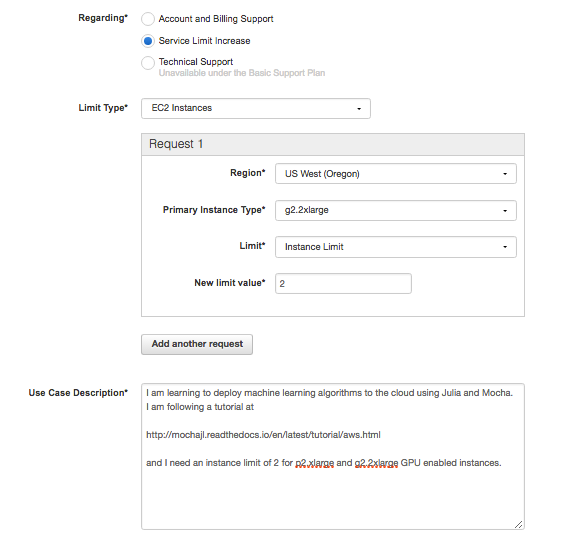
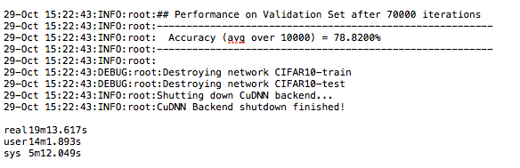

# Mocha on Amazon Web Services (AWS)
The real power of developing deep learning networks is only realized when you can test your ideas and run your models on powerful 
compute platforms that complete training in a fraction of the time it took only a few years ago.  Today state-of-the-art 
machine learning algorithms routinely run on cloud based compute that offers access to cutting edge GPU technology 
for a tiny cost compared to buying the GPU hardware and running it in your personal or company servers.

Amazon Web Services (AWS) is one of the most popular cloud based services that provide access to such powerful computers.  As Mocha
and Julia mature I'm sure that a pre-configured Amazon Machine Image (AMI) will emerge to run Mocha in the cloud. Now, in October
2016, such an AMI does not exist, but even when a pre-configured image for Mocha does become available I highly recommend following
through this tutorial at least once so you understand how cloud resources are provisioned and configured.

We are going to show you how to take the CIFAR-10 example and get it running in the cloud.  Along the way you will learn how to 
interact with AWS and get a broader understanding of cloud architectures in general.

## Signing up for AWS
The first task in getting up and running in AWS is to set up an account.  If you already have an Amazon.com shopping account these same credentials and methods of payment will get you into AWS.  If not, then sign up for an [account here](https://aws.amazon.com). There is no charge for signing up for the account.

Usage for AWS is dependent on two factors.  The type of computer you use, called the *instance type*, and the hours you use it for.
For this example we are going to provision an instance type called *p2.xlarge* which contains one NVIDIA Tesla K80 GPU, and costs about
90 cents per hour (as of Oct 2016).  Building the software and running the CIFAR10 training will take less than two hours.

**However, AWS does not let brand new users launch *p2* or *g2* instances when you first open your account.**  So you need to apply
for access to GPU enabled machines by opening a support request.  From the AWS Console (after signing in) click on *support* in the
top right hand corner and select *support center* from the dropdown menu. 

When the support page opens up click on .  This will open up a form similar to the figure below.  Choose the region closest to your location and submit the request with the text and options suggested by the figure.



## While you wait 
Approval of the support request might take a few days.  So while you wait let me suggest a few ways to
sharpen your knowlege of AWS, Mocha, or deep learning 

#### Track 1 - Deep learning expert but new to AWS

#### Track 2 - Cloud comfortable but new to Mocha or Deep Learning
Since we are going to be using the CIFAR10 example later in this tutorial and training it in the cloud, why not 
download the original paper on the dataset and one of the first convolutional neural network implementations
that threw the gates open to deep learning back in 2012.  Before this seminal paper neural networks deeper than
one or two layers were untrainable because the backpropogation of gradients from the output layer had lost their
corrective strength by the time they reached the bottom layers of deep networks.  

Work through the EC2 tutorials for the few days so you learn how to launch and manage your instances.

## Provisioning the instance and the base image
At this point you should have heard back from AWS that you are approved for AWS *g2* and *p2* instance types.
Now we need to launch a GPU instance with NVIDIA drivers and the Cuda components needed to work with the GPU.

First let me explain just a little about Cuda.  

The Amazon *p2* instance contains both a CPU and an [NVIDIA Tesla K80](http://www.nvidia.com/object/tesla-servers.html) GPU, but
in order to access the GPU the NVIDIA drivers for the P80 must be installed and the various elements of the NVIDIA development
environment must also be installed.  This [blog post](https://aws.amazon.com/blogs/aws/new-p2-instance-type-for-amazon-ec2-up-to-16-gpus/) describes how to install these components from scratch, but I find that
installing the correct NVIDIA driver and a compatible version of the Cuda Toolkit that is also compliant with the hardware on the
cloud instance can be quite a challenge.  To avoid this complication we are going to launch an instance in this tutorial from a commercially supported AMI available on the AWS marketplace.  

You can launch any AMI from the EC2 Management Console, but we will launch by clicking on this link for the [AWS Marketplace](https://aws.amazon.com/marketplace) and entering `Bitfusion Mobile Deep Learning` into the search bar.  Note that the commercially provided AMI costs another 9 cents per hour (Oct 2016 pricing), but the cost is well worth avoiding the headache of fighting the 
NVIDA/CUDA/INSTANCE configuration challenge.  

When the search results return click on the title of the AMI and it will take you to the configuration screen.  Select the Region where you were granted the *p2.xlarge* instance.

Then click on .

In the next screen ensure that you  choose *p2.xlarge* as the instance type and properly set the *Key pair* to a value in the dropdown menu where you have the private key stored locally, otherwise you will not be able to `ssh` into the new instance.

## Verify NVIDIA Drivers and CUDA Toolkit are Working
TODO: build a shell script that checks output from these two components  
`nvidia-smi`  
`which nvcc`

## Installing Julia
Julia is new, which means that a lot of things that are annoying about other programming languages are "fixed" and sometimes even "FUN" in Julia.

Julia is new, which also means that it is not pre-installed in very many Amazon Machine Images (AMIs) so we will be building Julia
from source.  Note that I have tried the [Bitfusion Scientific Computing AMI](https://aws.amazon.com/marketplace/pp/B00Z8C6ZQS) that
includes Julia and NVIDIA drivers, but when I add Mocha, enable the GPU backend and run `Pkg.test("Mocha")` it fails with an error in
`CuDNN.jl` file.

#### Build from scratch in apt-get based AMIs
```bash
#! /bin/bash
# Install build environment
echo "*****************Setting up the Build Environment******************"
# Running the update/upgrade on takes about 5 min
sudo apt-get update
sudo apt-get upgrade
# Note I got asked about Docker upgrade on the Bitfusion AMI wich uses
# Docker to manager other services in the AMI.  Choose option 'N' on this
# question

# Takes less than a minute
# Other packages required but already in this AMI are:
# git g++ 
# I have not tested the assertion from someone else's guide was that 
# the Julia build also requires
# gfortran
sudo apt-get install cmake hdf5-tools m4 libopenblas-base 

echo "*****************Cloning Julia*************************************"
git clone https://github.com/JuliaLang/julia.git
cd julia
# As of Oct 2016 Julia v0.4.7 is the latest compatible vesion with Mocha
git checkout v0.4.7

#Determine the number of CPUs to build on
NUM_CPUS=$(lscpu | awk '/^CPU\(s\):/ {print $2}')

echo "*****************Making Julia on $NUM_CPUS CPUs***************************"
#Takes 30 minutes on a 4CPU p2.xlarge AWS instance
sudo make -j $NUM_CPUS
```

When the build completes take a look at the folder and notice that it now
contains an executable named `julia`.  We want to link that executable into
the PATH so issue this command, `sudo ln -s -f ~/julia/julia /usr/local/bin/julia`

Open the new executable with `julia` and run `Pkg.add("Mocha")`.
Follow a successful Mocha installation with `Pkg.test("Mocha")`.

God willing and the crik don't rise (..as my Texan grandfather would say) you
will get a successful Mocha test on AWS.  Now we need to enable GPU operations
and test on the GPU backend.  Still in the Julia REPL issue `Pkg.dir("Mocha")`
and make note of the Mocha directory.  Then exit out of the Julia REPL with `exit()`.

Change into the Mocha directory and then `cd src/cuda/kernels`.  Take a look
at the files here and notice the `Makefile` that will build the cuda 
kernals used by Mocha.  Issue `make` to build these kernals with the `nvcc`
command.

Now we need to export an environment variable to tell Julia to use the GPU
backend.  At the ubuntu prompt enter `export MOCHA_USE_CUDA='true'`.  You 
can issue `env` to see all environmental variables and you will see that our
Mocha control variable has been added to the environment.

Restart Julia with the `julia` command that is globally available now.  
At the prompt issue `Pkg.test("Mocha")`.  Now the tests will restart but in the
first few lines of the image below you will notice that `* CUDA enabled` caught
the environment variable and is going to use the GPU backend to run the tests.
If everything has been set up right then you should get the output below which
takes about five minutes to run.


## Running the CIFAR10 Test
At this point the CIFAR10 example should run without any problems.  There are
links to the example files in the AWS example folder.  Change directory into
`/path/to/Mocha/examples/AWS`.  Run `./get-cifar10.sh`.  Once the data
is downloaded you can run the example by issueing `julia cifar10.jl`.

Once the example starts to run take note that the environment variable we set
for `Pkg.test("Mocha")` is still in place so you should see `* CUDA enabled` 
and that the `DefaultBackend = Mocha.GPUBackend`.  This is awesome because
you are now going to train the CIFAR10 network in the cloud and you will see
that it only takes about 3 seconds to train 200 interations of backpropogation.
Compared to my MacBook Pro this is about 28 times faster (19 min vs 530 min).




install packages needed to build Julia from source with `sudo apt-get install g++ gfortran m4 cmake pkg-config git hdf5-tools`.  Note that `hdf5-tools` is not required to install Julia, but is required to install the `Mocha` package later in this build guide, and when Julia tries to call `sudo apt-get` from within the REPL it aborts in AWS.  So it is better to get `hdf5-tools` in place now. 

Note that the version of Julia available in apt-get is just 0.2 which failed when I tried to run the `cifar10.jl` script.  So clone the git repo with `git clone git://github.com/JuliaLang/julia.git`.  This installs the source in a `/julia` directory.  

I built Julia from the head of the master branch the first time and it failed to run `Pkg.test("Mocha")` later in the process.  So it is better practice to build a core component such as a programming language from its stable release unless you plan to contribute to the development of the language itself.  To find a stable version and build against that version we will use the version control properties of `git`.

Change directory into the newly cloned julia folder with `cd julia`.  Then issue a `git status` command.  You should see git identifies this folder as a project under version control.  Now issue the `git tag` command.  This will provide a list of tagged releases similar to the list below:
> v0.4.5  
> v0.4.6  
> v0.4.7  
> v0.5.0  
> v0.5.0-rc0  
> v0.5.0-rc1  

We want to use the last stable release not a release candidate `v0.X.0-rcX`.  So we issue a git command to checkout to the most recent stable branch which at the time I made this tutorial would be `git checkout v0.5.0`.  

We want to build Julia on the maximum number of cores available to the server. To find the number of available cores run `lscpu`.  See the link [here](http://unix.stackexchange.com/questions/218074/how-to-know-number-of-cores-of-a-system-in-linux) for a good explanation of the output of `lscpu`.  

Finally, build the julia executable with `sudo make -j N` where `N` is the number of CPUs on the cloud instance.  It took about ten minutes to build from source on a *p2.xlarge* AWS instance with 4 CPUs.

Add a link to the `/usr/local/bin` directory that puts the `julia` executable in the path with the link command `sudo ln -f -s ~/julia/julia /usr/local/bin/julia`.  This allows you to issue the `julia` command from anywhere and it will launch the REPL or invoke julia to run a program.

The build instructions also recommend running `make testall` before using the executable and this takes about ten minutes to run all the tests. 

Once built, launch Julia and `Pkg.add("Mocha")`.  Once Mocha loads run `Pkg.test("Mocha")` to ensure that all components in the package are working.  I've had problems here and have solved them by removing Mocha, re-adding it and once I had to ensure the git branch was set to master instead of `<HEAD>`.  After Mocha finishes all of its tests then exit the Julia REPL.

#### Build from scratch in yum based AMIs
```
#! /bin/bash
# Install build environment
# The sed instruction allows the Extended Packages For
# Enterprise Linux (epel) repository to get added to the yum package
# manager. sed -i option edits in place.
echo "*****************Setting up the Build Environment******************"
sudo sed -i 's/enabled=0/enabled=1/' /etc/yum.repos.d/epel.repo
sudo yum -y update
sudo yum -y upgrade
# I need to check which of these are needed
sudo yum -y install git gcc-gfortran clang m4 patch ncurses-devel python-devel

#Set up Julia
echo "*****************Cloning Julia*************************************"
git clone https://github.com/JuliaLang/julia.git
cd julia
git checkout v0.4.7

#Determine the number of CPUs to build on
NUM_CPUS=$(lscpu | awk '/^CPU\(s\):/ {print $2}')

echo "*****************Making Julia on $NUM_CPUS CPUs***************************"
#Takes 30 minutes on a 4CPU p2.xlarge AWS instance
time make -j $NUM_CPUS
```
